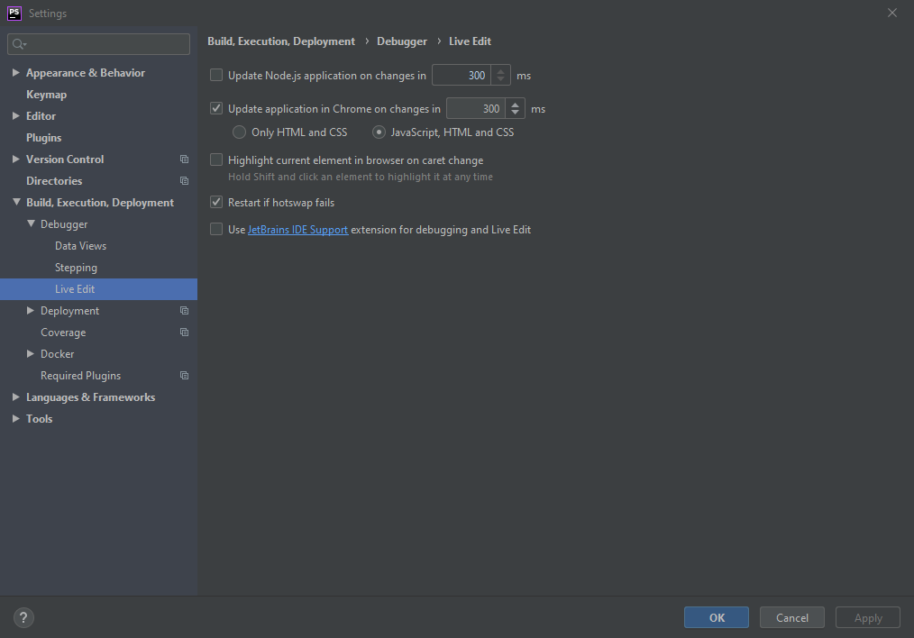
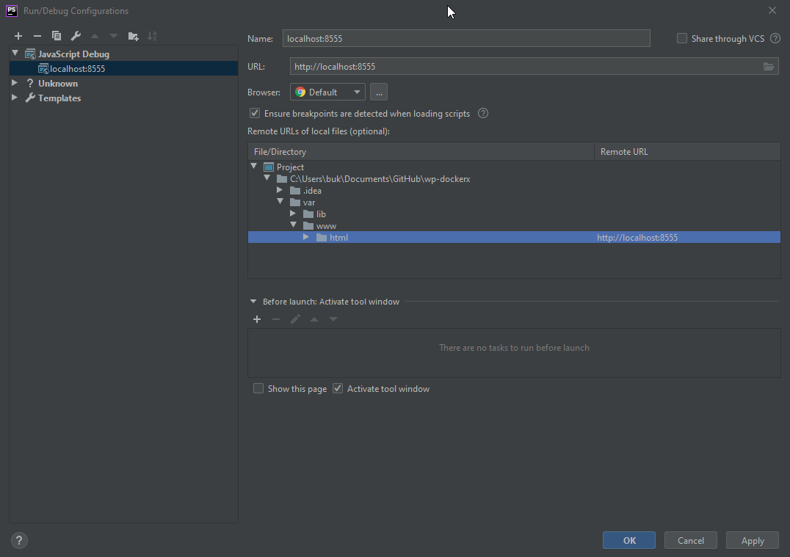
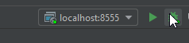

1. Install Live Edit plugin.
2. If you want to use your extensions in chrome, you have to use [chrome extension](https://chrome.google.com/webstore/detail/jetbrains-ide-support/hmhgeddbohgjknpmjagkdomcpobmllji?hl=en) (see picture 1 "User JetBrains IDE Support")

3. `docker-compose up` to run your application.
